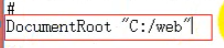
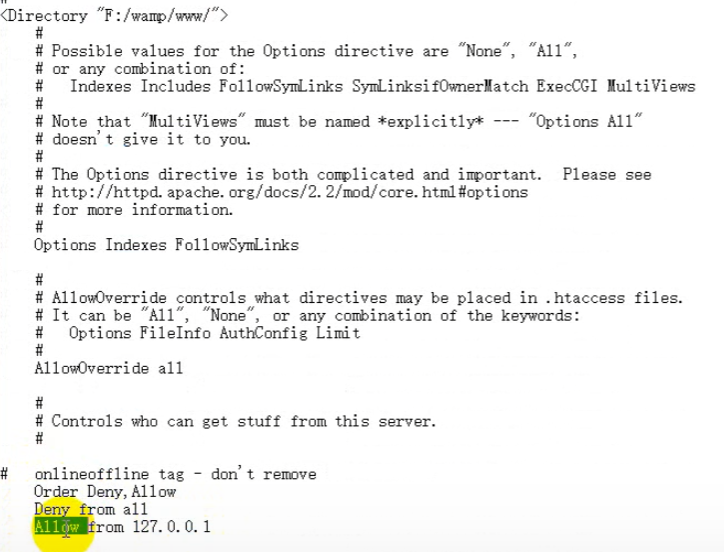
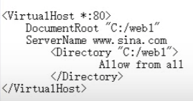

### apache 配置虚拟目录
在httpd.conf中设置
<Directory "C:\web">

Allow from all   //权限

### 虚拟目录与站点区别
站点：就是一个文件夹
虚拟目录：文件夹加权限

### index更改首页
DirectoryIndex  //设置网络首页
在apache配置文件中

### 更改端口
Listen 端口号
默认请求80
http://网址[:端口号]/php

### DNS解析
通过dns数据库返回真实ip地址
本机的dns解析库在"windows\System32\drivers\etc\hosts"

### 虚拟主机
一个apache支持多个网站，从浏览者看起来都是一个虚拟主机
1. 开启虚拟主机设置vhost.conf  在配置文件
2. 打开apache\apache2.2.17\conf\extra\vhosts-conf
3. 设置document servername(提前做好dns解析和权限设置)
   

### 总结
apache可以通过域名解析同ip端口指向不同虚拟主机
#### 知识来源
[Apache知识](https://www.bilibili.com/video/BV1JJ411K7Dz?spm_id_from=333.337.search-card.all.click&vd_source=99a84026be75fc77ea32288e60fcb6b4)